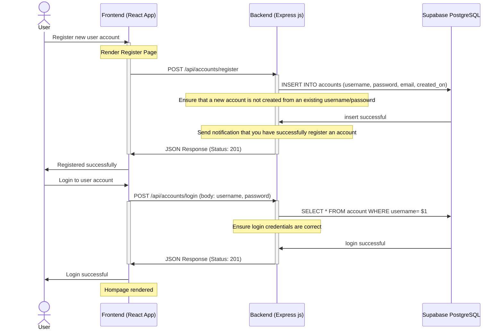

```mermaid
sequenceDiagram
  actor User
  participant FE as Frontend (React App)
  participant BE as Backend (Express js)
  participant DB as Supabase PostgreSQL

  %% Register user account
  User ->> FE: Register new user account
  activate FE
  Note over FE: Render Register Page 
  FE ->> BE: POST /api/accounts/register
  activate BE
  BE ->> DB: INSERT INTO accounts (username, password, email, created_on)
  Note over BE: Ensure that a new account is not created from an existing username/passowrd
  DB ->> BE: insert successful
  Note over BE: Send notification that you have successfully register an account
  BE ->> FE: JSON Response (Status: 201) 
  deactivate BE
  deactivate FE
  FE->> User: Registered successfully

  %% Login to homepage
  User ->> FE: Login to user account
  FE ->> BE: POST /api/accounts/login (body: username, password)
  activate BE
  activate FE
  BE ->> DB: SELECT * FROM account WHERE username= $1 
  Note over BE: Ensure login credentials are correct
  DB ->> BE: login successful
  BE ->> FE: JSON Response (Status: 201) 
  deactivate BE
  deactivate FE
  FE ->> User: Login successful
  Note over FE: Hompage rendered


```
